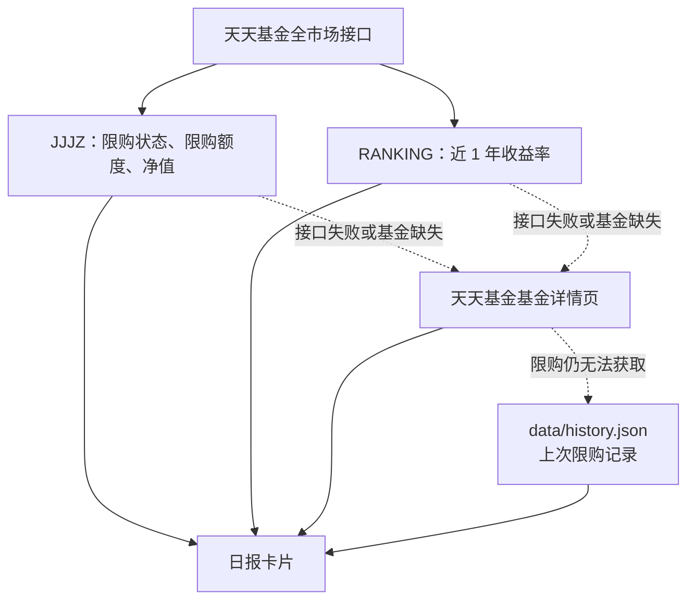
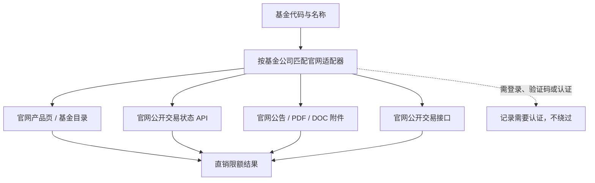

# 数据来源说明

## 日报卡片的数据来源框架

当前日报卡片**只使用天天基金数据**，基金公司官网直销数据尚未接入卡片。日报有完整兜底：限购字段依次采用 `JJJZ → 天天基金详情页 → 本地上次记录 → 未知/失败`；近 1 年收益率采用 `RANKING → 天天基金详情页 → 空值`（收益率不使用历史值）。

正常情况下，卡片由天天基金的两个全市场接口组成；只有接口失败或缺少某只基金时，才查询天天基金详情页。详情页也拿不到限购信息时，才使用本地历史记录；近 1 年收益率没有历史兜底。

| 数据 | 正常来源 | 具体接口 | 降级与最终结果 |
|---|---|---|---|
| 限购状态、限购额度、净值 | 天天基金 JJJZ 全市场接口 | `GET https://fund.eastmoney.com/Data/Fund_JJJZ_Data.aspx?t=8&page=1,50000&js=reData&sort=fcode,asc` | 详情页 → `data/history.json` 同分组 `latest` → `未知/失败` |
| 近 1 年收益率 | 天天基金 RANKING 全市场接口 | `GET https://fund.eastmoney.com/data/rankhandler.aspx`，参数含 `op=ph`、`pn=50000`、`dx=0`、运行日前 365 天的 `sd/ed` | 详情页 → 空值 |
| HTML 降级 | 天天基金单基金详情页 | `GET http://fund.eastmoney.com/{fund_code}.html` | 页面也无法解析限购时才读取本地历史 |
| 本地历史 | 上次成功/上次运行快照 | `data/history.json`：`passive.latest` 或 `active.latest` | 输出 `source=stale`、低置信度和“数据陈旧”告警 |

当 JJJZ、HTML 与历史均不可用时，结果为 `source=none`；该基金不绘制到日报卡片，飞书健康提醒会列出失败原因。

## 基金公司直销的数据来源框架

这是一套独立抓取能力，入口为 `fetch_official_limits()`；当前不参与日报卡片生成。它只访问基金公司的官方域名，不以第三方平台补数。

### 直销数据置信等级

直销模块当前会输出来源、状态、链接和说明；下列 P1–P4 是建议在消费直销结果时采用的统一优先级（越小越可信/越接近当前交易状态）。

| 等级 | 来源类型 | 判定 | 示例 |
|---|---|---|---|
| P1 | 官网实时交易状态 API / 可验证公开交易 API | 直接返回当前基金、当前渠道的申购状态或限额 | 南方 `subscriptionAndRedemptionStatus`；易方达交易状态 API；宝盈公开交易 API |
| P2 | 官网实时产品页、官网公开限额表 | 页面或目录直接给出当前直销限额/状态 | 嘉实官网申购上限表；博时官网目录/产品页 |
| P3 | 官网最新限额公告及附件 | 从官网公告、PDF、DOC、DOCX 中按基金代码解析；可能需要等待公告更新 | 大成、富国、建信、长城、华宝、摩根、万家、景顺长城、国富、天弘等官网公告 |
| P4 | 官网入口追踪、产品页可访问、认证边界 | 没有取得可验证额度，只能证明入口存在或必须登录 | 产品页无字段、跳转登录页、验证码/会话限制 |

`direct_sales_status=ok` 或 Adapter 明确返回 `paused` 的 P1–P3 结果可展示为直销限额/状态；P4 必须显示为“未获取/需认证”，不能与实际限额混用。产品页存在但没有可验证的直销限额时，也只能归为 P4，避免把起购金额误当作限额。

### 已使用的官网接口与页面

| 公司/通用来源 | 级别 | 具体接口或页面 |
|---|---|---|
| 易方达 | P1 | `https://vip.efunds.com.cn/`（目录）；`https://www.efunds.com.cn/fund/{code}.shtml`（产品页）；`GET https://api.efunds.com.cn/xcowch/front/fund/tradestatus/{code}`（交易状态 API） |
| 南方 | P1 | `POST https://www.nffund.com/nfwebApi/customer/subscriptionAndRedemptionStatus`；`POST https://www.nffund.com/nfwebApi/fund/fundList`；`POST https://www.nffund.com/nfwebApi/fund/overreview` |
| 宝盈 | P1 | `GET https://ibao.byfunds.com/agate/api/v1/fund/detail?fundcode={code}` |
| 嘉实 | P2 | `GET https://www.jsfund.cn/main/a/20151216/191092.shtml` |
| 博时 | P2 | `https://www.bosera.com/fund/index.html`；`https://www.bosera.com/fund/{code}.html` |
| 华安 | P2/P3 | `https://wap.huaan.com.cn/`；`https://wap.huaan.com.cn/funds/{code}/index.shtml` |
| 国泰 | P2/P3 | `https://e.gtfund.com/Etrade/Jijin/view/id/160213`（目录）；`https://e.gtfund.com/Etrade/Jijin/view/id/{code}` |
| 华泰柏瑞 | P2/P3 | `https://www.huatai-pb.com/common/index.html.js?v=`（目录脚本）；`https://www.huatai-pb.com/products/{code}/index.html` |
| 华夏 | P2/P3 | `https://fund.chinaamc.com/front/front/es/fundInfo/fundList`；`https://www.chinaamc.com/fund/{code}/index.shtml`；`https://fund.chinaamc.com/ProductForWeb/getCalendar` |
| 大成 | P3 | `GET https://www.dcfund.com.cn/servlet/json`（官网目录/公告 API）；`https://www.dcfund.com.cn/main/fund/productdetail/index.shtml?product_code={code}` |
| 富国 | P3 | `https://www.fullgoal.com.cn/fundDetail/{code}/index.html`；从产品页定位官网公告详情及 PDF |
| 国富 | P3 | `https://www.ftsfund.com/index/jjcs`；`https://www.ftsfund.com/qxjj/jjxq/{code}`；`https://www.ftsfund.com/qxjj/jjxq/xxplload?fundCode={code}&page=1` |
| 建信 | P3 | `GET https://www.ccbfund.cn/website/v1/api/fundList`、`/website/v1/api/fund/detail?fundCode={code}`、`/website/v1/api/fund/notice?fundCode={code}`；公告详情及 DOC/PDF 附件 |
| 长城 | P3 | `https://www.ccfund.com.cn/main/jjcp/index.shtml`、`/main/jjcp/cache/{code}.shtml`；产品页公告接口及 `https://www.ccfund.com.cn/main/files/{YYYY}/{MM}/{DD}/{公告文件名}.pdf` |
| 摩根 | P3 | `https://www.cifm.com/fund/`；`https://www.cifm.com/fund/{code}/`；官网搜索 `https://www.cifm.com/web/search` 及公告 PDF |
| 万家 | P3 | `https://www.wjasset.com/common/index.html.js`（`FundArr` 目录）；`https://www.wjasset.com/products/{kind}/{code}/index.html`；公告 CMS/PDF |
| 景顺长城 | P3/P4 | `https://www.igwfmc.com/main/jjcp/product.html`；`https://www.igwfmc.com/main/jjcp/product/{code}/detail.html`；官网公告入口及 PDF；交易入口仍需认证 |
| 天弘 | P3 | `https://www.thfund.com.cn/thfund/fundlist/api`；`https://www.thfund.com.cn/fundinfo/{code}`；官网公告 CDN PDF |
| 汇添富 | P3 | `https://www.99fund.com/main/products/pofund/{code}/fundgg.shtml`（公告）；`https://www.99fund.com/main/products/pofund/{code}/fundgk.shtml`（产品页） |
| 广发 | P1/P3 | `https://www.gffunds.com.cn/funds/?fundcode={code}`；`fund-person-limit.shtml`/`fund-org-limit.shtml`；公告列表及 PDF；交易入口只作认证边界探测 |
| 招商 | P2/P3 | `https://www.cmfchina.com/web/fundDetail/{code}/index.html`；公开目录/详情 API；公告详情 |
| 华宝 | P3/P4 | `https://www.fsfund.com/fund/fundMarket.shtml`（`fundMarketList` 目录）；`https://www.fsfund.com/fund/{code}/fundDetail.shtml`；官网限额公告 PDF；交易入口仍可能需要认证 |
| 浦银安盛 | P2 | `https://www.py-axa.com/middle-platform-gateway/wechatwork-product-biz/front/api/sales/fundList`；`.../fund/info`；`.../notice/list`；官方公告 PDF |
| 银华 | P4 | `https://www.yhfund.com.cn/main/fund/index.shtml`、`https://trade.yhfund.com.cn/yhxntrade/account/goLogin.do` |

## 目前已实现的基金公司数据

已注册并纳入官网直销数据框架的基金公司共 24 家：

| 当前状态 | 基金公司 |
|---|---|
| 已有专用解析器或公开 API / 公告解析（P1–P3） | 大成、国泰、广发、华安、易方达、华夏、南方、天弘、嘉实、博时、招商、华泰柏瑞、摩根、汇添富、建信、宝盈、万家、华宝、国富、长城、富国、景顺长城、浦银安盛、银华 |
| 尚无独立 Adapter，当前仅纳入官网入口追踪（P4） | （无） |

其中，官网访问受登录、验证码或会话限制的情况会输出“需认证”状态；这不是抓取失败后改用第三方数据，而是明确保留官方渠道的认证边界。
